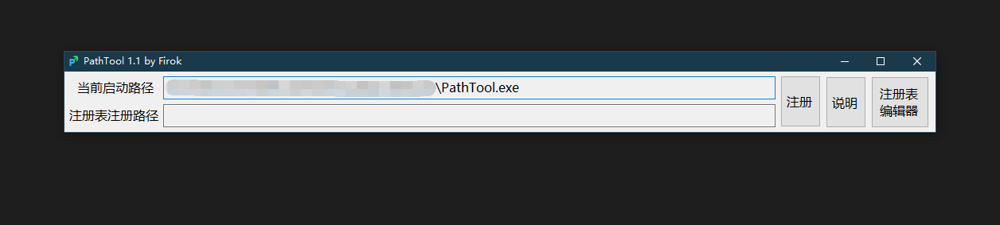
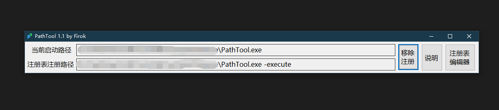
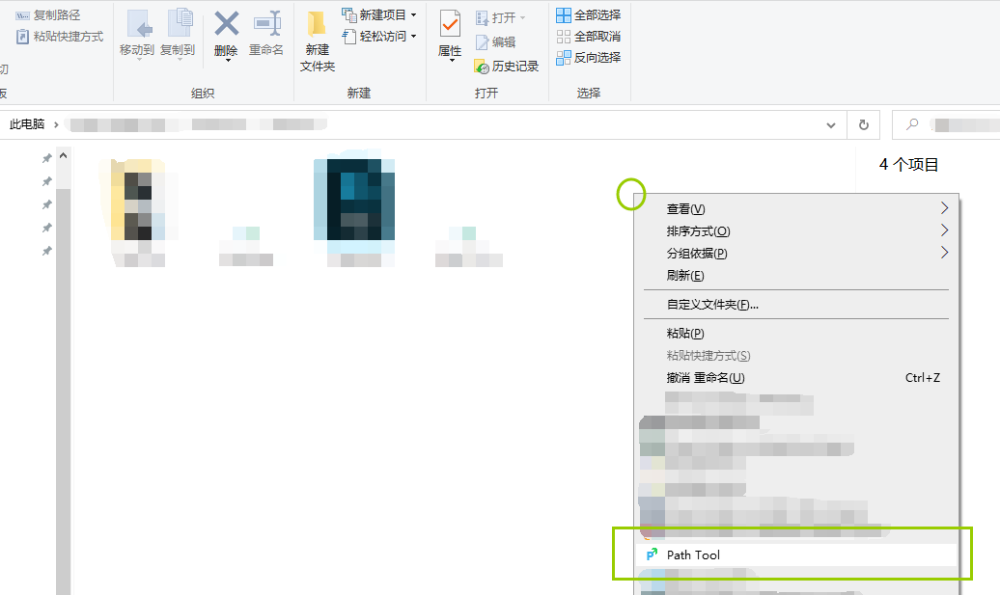
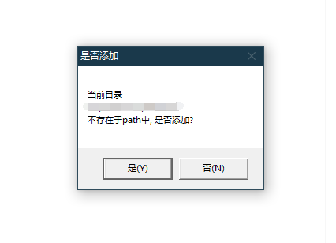

# Path Tool

一个快速修改系统环境变量`path`的小工具.

下载地址: [GitHub Release](https://github.com/351768593/PathTool/releases)

## 使用说明

双击启动后, 点击注册按钮可以将本工具注册至资源管理器右键菜单.

> 向注册表中注册的快捷方式中包含一个` -execute`, 因为我们通过检查启动参数
> 来判断本次是*鼠标双击*启动还是*鼠标右键操作*启动

注册成功后, 打开任意目录, 鼠标右键**空白处**即可看到新增的**Path Tool**操作.

> 您可以将本工具置于任意位置, 但是更换位置需要重新注册

执行该操作后, 工具将会判断指定目录是否在系统环境变量`path`中, 然后提示是否添加/移除该目录.

> 我们检查目录路径是否在`path`内的方式是逐个对比字符串是否相等,
> 而不是逻辑上是否指向相同位置

## 感谢以下各位参与测试

* Kirisu
* madflea
* Notsfsssf
* scott
* yyh
